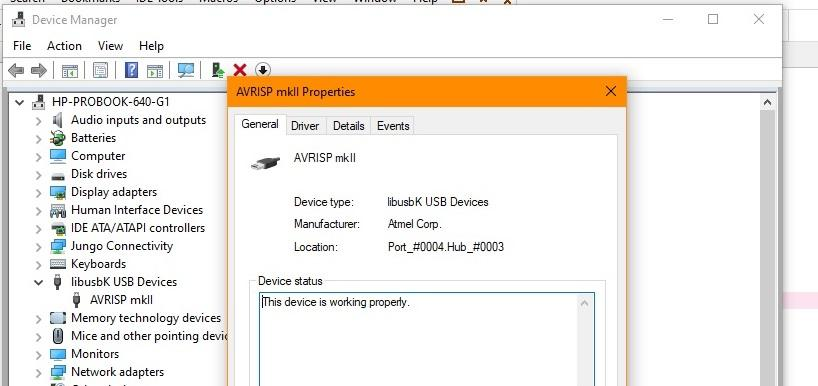
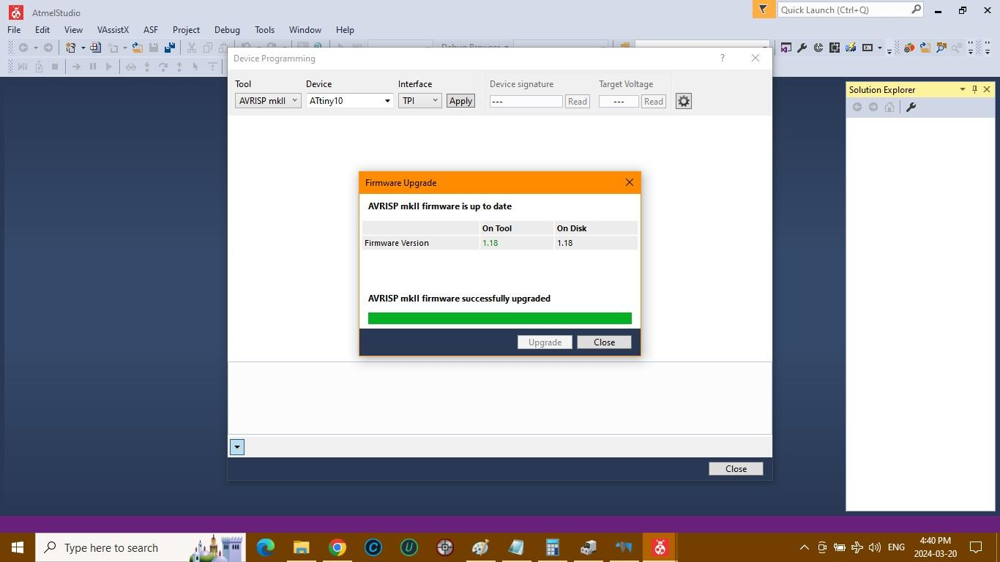
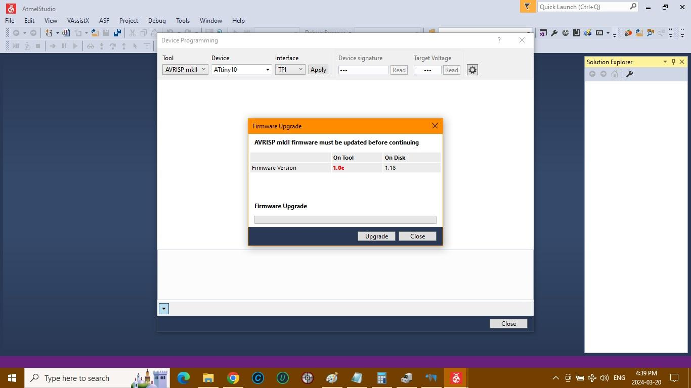
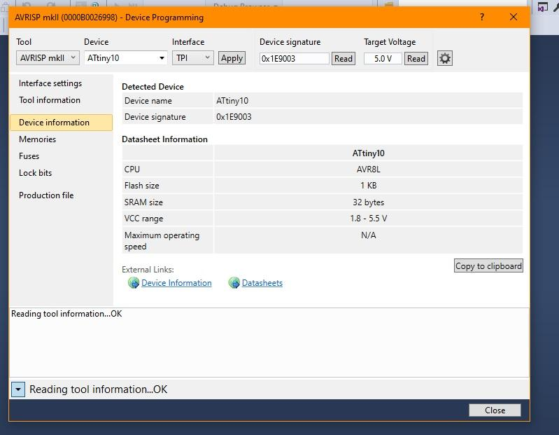
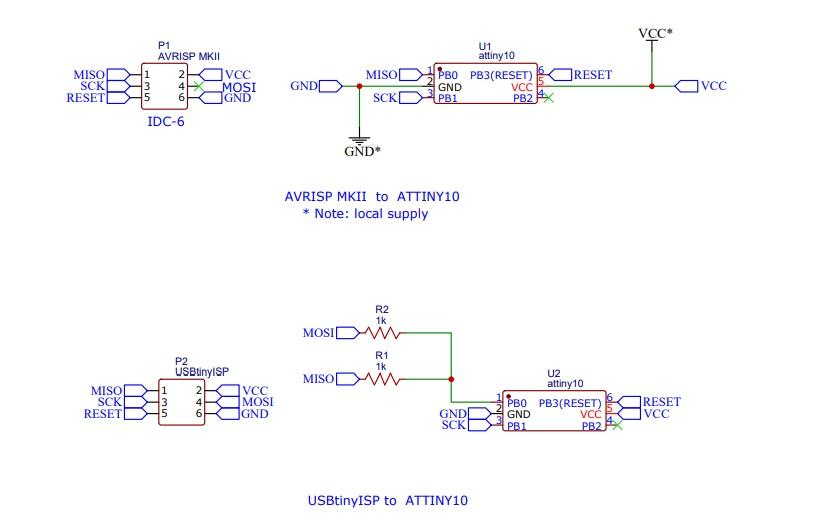
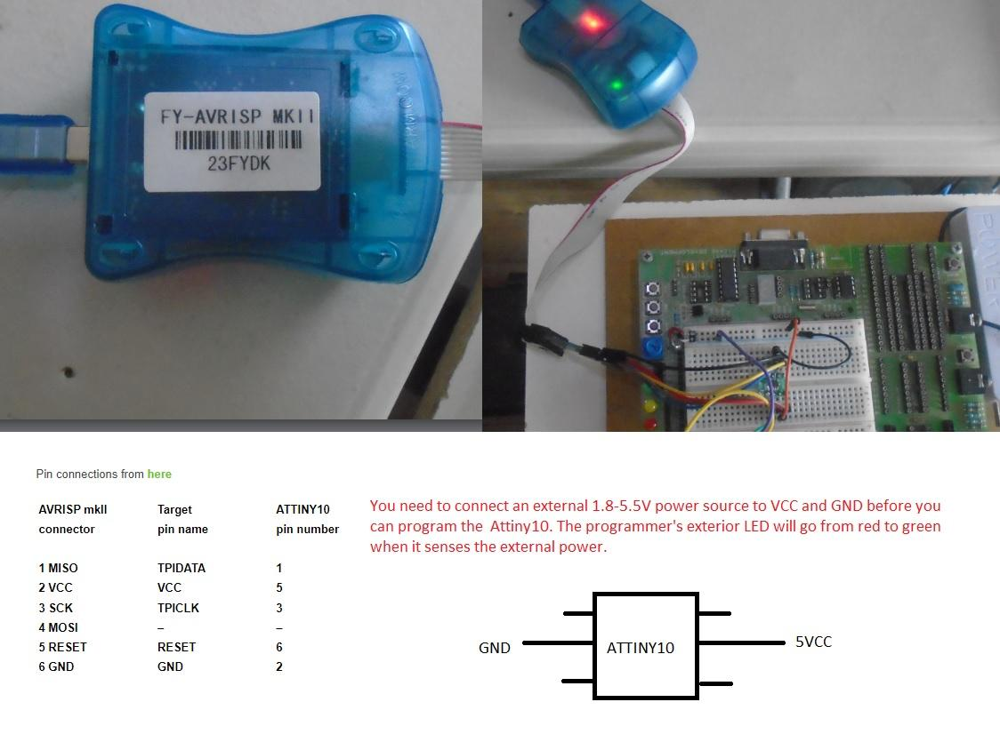
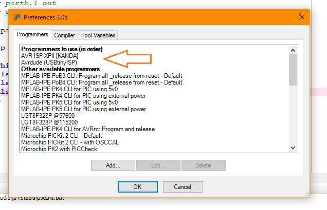

== Using a ATTiny10  with AVRISP and USBtinyISP programmer

// Hidden information
// the pictures are linked,  there is no specific order and I ( Anboium ) do not know the correct sequence.&#160;&#160; 

USBtinyISP :

Windows 10 Device Manager Driver: libusb-win32 (from Zadig)

Pin connections : see pic below:

{empty} +

{empty} +

{empty} +

AVRISP MKII:

Windows 10 Device Manager Driver: libusbK (from ATMEL Studio 7) see pic below
Needed to upgrade firmware version to 1.18 with ATMEL Studio 7 (using device programming sub menu under Tools)

Pin connections: see pic below.

{empty} +

{empty} +

{empty} +

image::USBtinyISP to ATTINY10 connections.jpg{}
{empty} +
