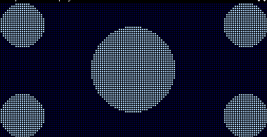

<div class="section">

<div class="titlepage">

<div>

<div>

#### <span id="_filledcircle"></span>FilledCircle

</div>

</div>

</div>

<span class="strong">**Circle:**</span>

``` screen
    FilledCircle(XPixelPosition, YPixelPosition, Radius [,Optional LineColour] )
```

<span class="strong">**Explanation:**</span>

Draws a circle on a GLCD at `XPixelPosition`, `YPixelPosition` with a
specific `Radius`.

<span class="strong">**Example:**</span>

``` screen
    #include <glcd.h>

    filledcircle(10,10,10)  ;upper left
    filledcircle(117,10,10) ;upper right
    filledcircle(63,31,10)  ;center
    filledcircle(63,31,20)  ;center
    filledcircle(10,53,10)  ;lower left
    filledcircle(117,53,10) ;lower right
```

<div class="informalfigure">

<div class="mediaobject" align="center">



</div>

</div>

</div>
