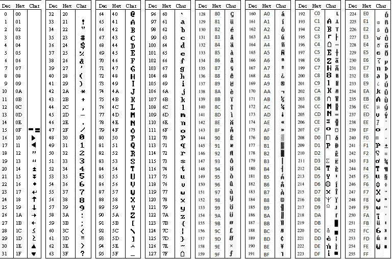

##### Fonts and Characters

This section covers GLCD fonts and characters.

**GLCD Support for Fonts**

lorem ipsum.  

**GLCD Support for Characters**

lorem ipsum.  

**GLCD Character Table**

lorem ipsum.  

**GLCD Controlling Constants**

The GCBASIC constants for control of fonts and characters are shown in
the table below.

| **Constants** | **Controls** | **Options** |
|:------------------------------------------|:-----------------------------------------|:----------------------------------------|
| `CONSTANT`                                | Words                                    | Explaination                            |
| `ANOTHER CONSTANT`                        | Words                                    | Explaination                            |

**For more help, see**
<a href="_glcdcls.html" class="link" title="GLCDCLS">GLCDCLS</a>,
<a href="_glcddrawchar.html" class="link" title="GLCDDrawChar">GLCDDrawChar</a>

