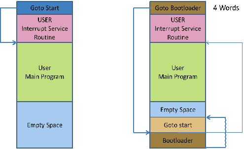

<div class="section">

<div class="titlepage">

<div>

<div>

### <span id="_option_bootloader"></span>\#Option Bootloader

</div>

</div>

</div>

<span class="strong">**Syntax:**</span>

``` screen
    #option bootloader address
```

<span class="strong">**Explanation:**</span>

`#option bootloader` prevents the overwriting of any pre-loaded
bootloader code, vectors, etc. below the specified address. The GCBASIC
code will start at the specified `address`.

A bootloader is a program that stays in the microcontroller and
communicates with the PC, typically through a serial interface. The
bootloader receives a user program from the PC and writes it to the
flash memory, then launches this program for execution. Bootloaders can
only be used with microcontrollers that can write to their flash memory
through software.

The bootloader itself must be written into the flash memory with an
external programmer.

In order for the bootloader to be launched after each reset, a
`goto bootloader` instruction must exist somewhere in the first 4
instructions. There are two types of bootloaders: some that require the
user to reallocate the code, and others that themselves reallocate the
first 4 instructions of the user program to another location and execute
them when the bootloader exits.

The diagram below shows the architecture of a bootloader. The left-hand
side shows the operation of the instructions without a bootloader. The
right-hand side shows the initial instruction jumping to the bootloader,
then, once the bootloader has initialised, execution of the start code.

<div class="informalfigure">

<div class="mediaobject" align="center">



</div>

</div>

See [example bootload
software.](https://sourceforge.net/projects/tinypicbootload/files/)

<span class="strong">**Example:**</span>

``` programlisting
    #option bootloader 0x800
```

<span class="strong">**See Also:**</span>

<div class="itemizedlist">

-   <a href="_option_noconfig" class="link" title="#Option NoConfig">#Option NoConfig</a> — another
    option commonly used alongside a bootloader

</div>

</div>
