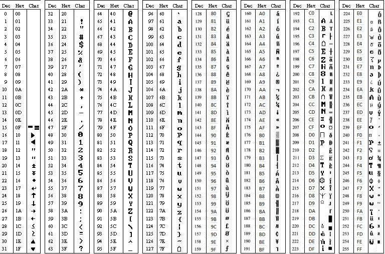

##### Fonts and Characters

This section covers GLCD fonts and characters.

**GLCD Support for Fonts**

GCBASIC includes a default fixed bitmap font (5 or 6 pixels wide, 7 or 8
pixels high, depending on the driver) that is always available and needs
no setup. Two optional font systems can be selected instead, by adding a
`#define` before `#include <GLCD.h>`:

-   `#define GLCD_EXTENDEDFONTSET1` — swaps in an extended character
    table covering ASCII 31-254 instead of the default limited range.
    This costs additional program memory (around 1.3 KB) in exchange for
    full extended-ASCII coverage.
-   `#define GLCD_OLED_FONT` — switches to a font engine tuned for
    OLED-family controllers (SSD1306, SH1106, and similar), with two
    internal sizes selected via `GLCDfntDefaultsize`.

Only one of these should be selected at a time; if neither is defined,
the compact default font is used.

**GLCD Support for Characters**

Characters are drawn using `GLCDDrawChar` (a single character) or
`GLCDDrawString`/`GLCDPrint` (a full string), which look up each
character’s bitmap in the currently selected font table and write it to
the display buffer at the given position.

There is no GLCD equivalent of `LCDCreateChar` (the character-LCD
command for defining custom characters) — the built-in GLCD fonts are
fixed, compiled-in bitmap tables. Genuinely custom fonts or characters
require the separate `glcd_ImagesandFonts_addin3.h` add-in, which loads
font or image objects from external EEPROM, identified by an object ID
and selected by setting `GLCDfntDefault` (the built-in font is object ID
`fntGCB`, value `0`).

For larger digit-only text, such as clock or counter displays,
`GLCDPrintLargeFont` uses a separate dedicated large font (13 pixels
high, digits and a limited symbol set only) rather than scaling the
normal character font.

**GLCD Character Table**

**GLCD Controlling Constants**

The GCBASIC constants for control of fonts and characters are shown in
the table below. Exact values are set by the specific display driver you
include and can vary between drivers.

| **Constants** | **Controls**                                          | **Options**                                                                                                           |
|:------------------------------------------|:----------------------------------------------------------------------------------|:--------------------------------------------------------------------------------------------------------------------------------------------------|
| `GLCDFontWidth`                           | Width, in pixels, of one character in the current font.                           | Typically `5` or `6`, depending on the driver and font selected.                                                                                  |
| `GLCDfntDefaultheight`                    | Height, in pixels, of one character in the current font.                          | Typically `7` or `8`, depending on the driver.                                                                                                    |
| `GLCDfntDefaultsize`                      | A scale multiplier applied to both the width and height when drawing a character. | `1` (normal size) by default; some drivers default to `2`. Also selects between the two internal `GLCD_OLED_FONT` sizes when that font is in use. |
| `GLCDfntDefault`                          | Selects which font/image object `GLCDDrawChar`/`GLCDDrawString` reads from.       | `0` (`fntGCB`, the built-in font) by default; set to a custom object ID only when using the `glcd_ImagesandFonts_addin3.h` add-in.                |

**See Also:**

-   <a href="glcd_overview" class="link" title="GLCD Overview">GLCD Overview</a> — category
    overview
-   <a href="glcddrawchar" class="link" title="GLCDDrawChar">GLCDDrawChar</a> — drawing
    a single character using the current font
-   <a href="glcddrawstring" class="link" title="GLCDDrawString">GLCDDrawString</a> — drawing
    a full string using the current font
-   <a href="glcdprint" class="link" title="GLCDPrint">GLCDPrint</a>
-   <a href="glcdprintlargefont" class="link" title="GLCDPrintLargeFont">GLCDPrintLargeFont</a> — the
    separate large digit-only font for clocks/counters
-   <a href="glcdprintwithsize" class="link" title="GLCDPrintWithSize">GLCDPrintWithSize</a> — drawing
    text at a specific `GLCDfntDefaultsize` scale

