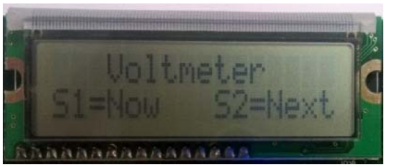
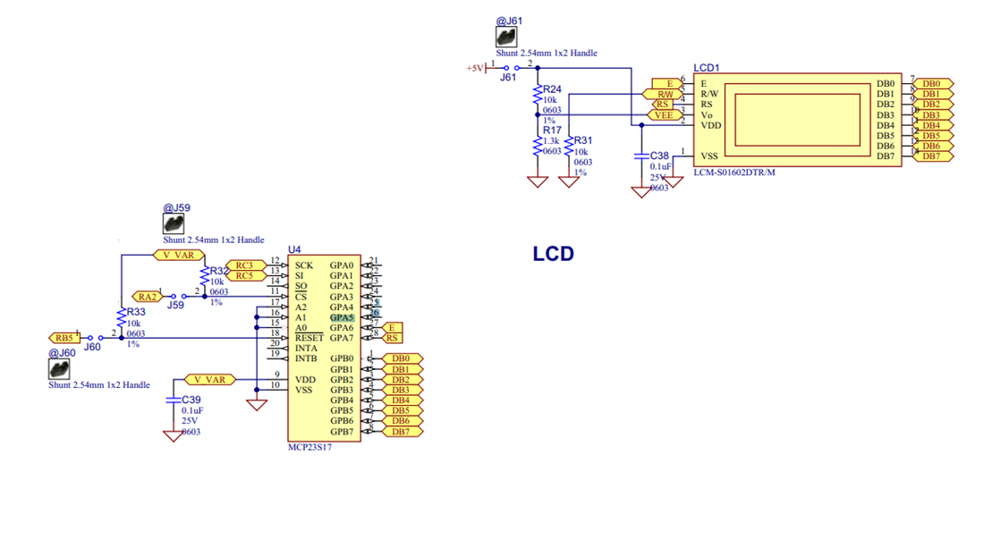

<div class="section">

<div class="titlepage">

<div>

<div>

##### <span id="lcd_io_14"></span>LCD\_IO 14

</div>

</div>

</div>

<span class="strong">**Using connection mode 14:**</span>

Using this LCD IO methof the LCD is controlled via an SPI expander.

To use mode 14 you must define the SPI ports as normal in your GCB code.
Then, define the LCD type, set the SPI address of the SPI expander, and,
the LCD speed, if required.

<div class="informalfigure">

<div class="mediaobject" align="center">



</div>

</div>

<span class="strong">**Relevant Constants:**</span>

These constants are used to control settings for the LCD routines
included with GCBASIC.   To set them, place a line in the main program
file that uses `#define` to assign a value to the particular constant.

When using this mode only three constants are mandated - all others can
be ignored.

<div class="informaltable">

| <span class="strong">**Constant Name**</span> | <span class="strong">**Controls**</span> | <span class="strong">**Value**</span> |
|:----------------------------------------------|:-----------------------------------------|:--------------------------------------|
| `LCD_IO`                                      | I/O mode                                 | `14`                                  |
| `LCD_SPI_DO`                                  | Microcontroller SPI data out port        | Required                              |
| `LCD_SPI_SCK`                                 | Microcontroller SPI clock out port       | Required                              |
| `LCD_SPI_CS`                                  | Microcontroller SPI chip select port     | Required                              |

</div>

<span class="strong">**Connectivity**</span>

The connectivity is shown below.  The microcontroller connections are as
shown below.  This is an example using the Microchip Explorer 8 board.

``` screen
    RC3 > Expander SPI SCK ( clock)
    RC5 > Expander SPI SI (slave in)
    RA2 > Expander SPI CS ( chip select) - could be set to 0v0
    RB5 > Expander Reset ( optional)
```

<div class="informalfigure">

<div class="mediaobject" align="center">



</div>

</div>

<span class="strong">**Optional configuration**</span>

There are some options you can tweak. See the example setup below. You
can play with the use of hardware or software SPI, SPI frequency (
HWSPIMODE MASTERFAST). LED speed, the connectivity between the expander
and the LCD and otheroptions.

``` screen
        //Constants - LCD connectivity type; controls whether to use HW SPI; The inter character delay
        #define LCD_IO 14
        #define LCD_HARDWARESPI
        #define LCD_SPEED FAST
        #define HWSPIMODE MASTERFAST

        //These are the phyiscal connections from the expander to the LCD.  These are automatically set in the library and are shown here purely for clarity.
        #define     LCD_SPI_EXPD_ADDRESS        0x40     // address of the expander
        #define LCD_SPI_EXPANDER_E_ADDRESS      0x40     // GPA6 on the expander
        #define LCD_SPI_EXPANDER_RS_ADDRESS     0x80     // GPA7 on the expander

        //Pin mappings for LCD IO SPI Expander
        #define LCD_SPI_DO          portc.5             // constant is mandated
        #define LCD_SPI_SCK         portc.3             // constant is mandated
        #define LCD_SPI_CS          porta.2             // constant is required.
        // Optional(s) reset Port.Pin connection to expander, select one.
            // #define LCD_SPI_RESET_IN       portb.5
            #define LCD_SPI_RESET_OUT      portb.5
```

For code examples see
<a href="http://github.com/Anobium/Great-Cow-BASIC-Demonstration-Sources/tree/master/LCD_Solutions" class="link">LCD Solutions</a>.

See the separate sections of the Help file for the specifics of each
Connection Mode.

<span class="strong">**For more help, see**</span>
<a href="lcd_io_0" class="link" title="LCD_IO 0">LCD_IO 0</a>,
<a href="lcd_io_1" class="link" title="LCD_IO 1">LCD_IO 1</a>,
<a href="lcd_io_2" class="link" title="LCD_IO 2">LCD_IO 2</a>
<a href="lcd_io_2_74xx164" class="link" title="LCD_IO 2_74xx164">LCD_IO 2_74xx164</a>,
<a href="lcd_io_2_74xx174" class="link" title="LCD_IO 2_74xx174">LCD_IO 2_74xx174</a>,
<a href="lcd_io_4" class="link" title="LCD_IO 4">LCD_IO 4</a>,
<a href="lcd_io_8" class="link" title="LCD_IO 8">LCD_IO 8</a>,
<a href="lcd_io_10" class="link" title="LCD_IO 10">LCD_IO 10</a>,
<a href="lcd_io_10" class="link" title="LCD_IO 10">LCD_IO 12</a>

</div>
