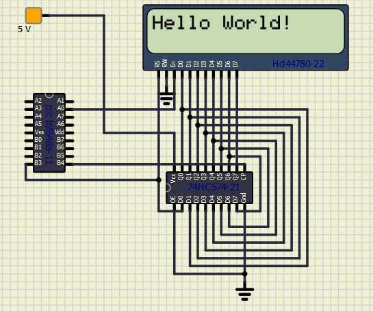

<div class="section">

<div class="titlepage">

<div>

<div>

##### <span id="lcd_io_3"></span>LCD\_IO 3

</div>

</div>

</div>

<span class="strong">**Using connection mode 3:**</span>

This method uses a Data and a Clock line via a shift register to control
the LCD display plus an Enable line. This method is used when the LCD is
connected through a shift register IC using a LS74574.

This connection method is also called a 3-wire connection.

The diagram below shows a method to connect the LCD to a
microcontroller.

<span class="inlinemediaobject"></span>

<span class="strong">**Relevant Constants:**</span>

Specific constants are used to control settings for the Liquid Crystal
Display routines included with GCBASIC. To set these constants the main
program should specific constants to support the connection mode using
\#define. When using 3-bit mode only three constants must be set.

<div class="informaltable">

| <span class="strong">**Constant Name**</span> | <span class="strong">**Controls**</span> | <span class="strong">**Default Value**</span> |
|:----------------------------------------------|:-----------------------------------------|:----------------------------------------------|
| `LCD_IO`                                      | The I/O mode.                            | `3`                                           |
| `LCD_DB`                                      | The data pin used in 3-bit mode.         | <span class="strong">**Mandated**</span>      |
| `LCD_CB`                                      | The clock pin used in 3- bit mode.       | <span class="strong">**Mandated**</span>      |
| `LCD_EB`                                      | The enable pin used in 3- bit mode.      | <span class="strong">**Mandated**</span>      |

</div>

<span class="strong">**Example:**</span>

``` screen
    #chip 16f628a, 4
    #option explicit

    ;Setup LCD Parameters
    #define LCD_IO 3

    'Change ports as necessary
    #define LCD_DB     PORTb.3            ; databit
    #define LCD_CB     PORTb.4            ; clockbit
    #define LCD_EB     PORTa.0            ; enable bit

      Dim BV as Byte


    'Program Start

     PRINT "GCBASIC"
     Locate 1,0
     PRINT "@2021"
     Wait 4 s

      DO Forever
           CLS
           WAIT 2 s
           PRINT "Test LCDHex "
           wait 3 s
           CLS
           wait 1 s


       for bv = 0 to 16
         locate 0,0
         Print "DEC " : Print BV
         locate 1,0
         Print "HEX "
         LCDHex BV
         Locate 1, 8
         LCDHEX BV, LeadingZeroActive

         wait 500 ms
       next
           CLS
           wait 1 s
           Print "END TEST"
      LOOP
```

See the separate sections of the Help file for the specifics of each
Connection Mode.

<span class="strong">**For more help, see**</span>
<a href="lcd_io_0" class="link" title="LCD_IO 0">LCD_IO 0</a>,
<a href="lcd_io_1" class="link" title="LCD_IO 1">LCD_IO 1</a>,
<a href="lcd_io_2_74xx164" class="link" title="LCD_IO 2_74xx164">LCD_IO 2_74xx164</a>,
<a href="lcd_io_2_74xx174" class="link" title="LCD_IO 2_74xx174">LCD_IO 2_74xx174</a>,
<a href="lcd_io_4" class="link" title="LCD_IO 4">LCD_IO 4</a>,
<a href="lcd_io_8" class="link" title="LCD_IO 8">LCD_IO 8</a>,
<a href="lcd_io_10" class="link" title="LCD_IO 10">LCD_IO 10</a>
or
<a href="lcd_io_12" class="link" title="LCD_IO 12">LCD_IO 12</a>

</div>
