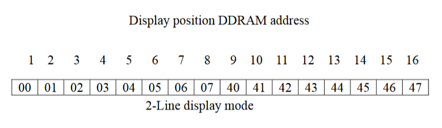

<div class="section">

<div class="titlepage">

<div>

<div>

##### <span id="lcd_variant"></span>LCD\_VARIANT

</div>

</div>

</div>

<span class="strong">**Using LCD\_VARIANT:**</span>

Some LCDs are non-standard.   The non-standard LCDs may have a different
memory architecture where the memory is non-consective or different
delay timing is required for the LCD IC.   Use `LCD_VARIANT` to change
the operating behaviour of GCBASIC with respect to LCD operations.   If
a `LCD_VARIANT` adaption has been created in the library then the
non-standard LCD can be supported.

<span class="strong">**\#DEFINE LCD\_VARIANT 1601a**</span>

Use `#define LCD_VARIANT 1601a` to use this sub variant. Requires a
LCD\_IO then this sub type modifier.   This variant has a non consective
memory as shown in the diagram below.

<div class="informalfigure">

<div class="mediaobject" align="center">



</div>

</div>

<span class="strong">**Example:**</span>

This example shows how to use the LCD\_VARIANT constant.   This example
shows the use of software I2C - any LCD mode can be used not just
software I2C.  

``` screen
    #chip tiny84,1

    'Set up LCD
    #define LCD_IO 10
    #define LCD_VARIANT 1601a
    #define LCD_WIDTH 16

    'You may need to use SLOW or MEDIUM if your LCD is a slower device.
    #define LCD_SPEED FAST

    ' ----- Define Hardware settings
    ' Define I2C settings - CHANGE PORTS FOR YOUR NEEDS
    #define LCD_I2C_Address 0x0E
    #define I2C_MODE Master
    #define I2C_DATA PORTA.4
    #define I2C_CLOCK PORTA.5
    #define I2C_DISABLE_INTERRUPTS ON

    'You may need to invert these states. Dependent of LCD I2C adapter.
    #define LCD_Backlight_On_State  1
    #define LCD_Backlight_Off_State 0

    ; ----- Main body of program commences here.
    Locate 0,0
    PRINT "GCBASIC"


    Do
    Loop
```

For code examples see
<a href="https://github.com/Anobium/Great-Cow-BASIC-Demonstration-Sources/tree/master/LCD_Solutions/Variant1601a_LCD_Solutions" class="link">I2C Variants LCD Solutions</a>.

See the separate sections of the Help file for the specifics of each
Connection Mode.

<span class="strong">**For more help, see**</span>
<a href="lcd_io_0" class="link" title="LCD_IO 0">LCD_IO 0</a>,
<a href="lcd_io_1" class="link" title="LCD_IO 1">LCD_IO 1</a>,
<a href="lcd_io_2" class="link" title="LCD_IO 2">LCD_IO 2</a>
<a href="lcd_io_2_74xx164" class="link" title="LCD_IO 2_74xx164">LCD_IO 2_74xx164</a>,
<a href="lcd_io_2_74xx174" class="link" title="LCD_IO 2_74xx174">LCD_IO 2_74xx174</a>,
<a href="lcd_io_4" class="link" title="LCD_IO 4">LCD_IO 4</a>,
<a href="lcd_io_8" class="link" title="LCD_IO 8">LCD_IO 8</a>,
<a href="lcd_io_10" class="link" title="LCD_IO 10">LCD_IO 10</a>

</div>
