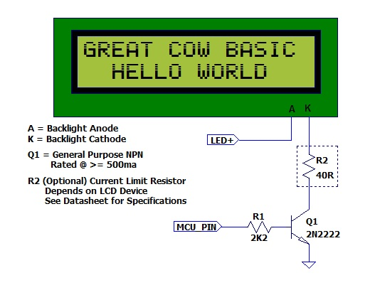

<div class="section">

<div class="titlepage">

<div>

<div>

#### <span id="lcdbacklight"></span>LCDBacklight

</div>

</div>

</div>

<span class="strong">**Syntax:**</span>

``` programlisting
    LCDBacklight ( On | Off )
```

<span class="strong">**Command Availability:**</span>

Available on all microcontrollers

<span class="strong">**Explanation:**</span>

Sets the LCD backlight on or off

Do not connect the LCD backlight directly to the microcontroller! Always
refer to the datasheet for the correct method to drive the LCD
backlight.

For 0, 4, 8, 404 LCD types you <span class="strong">**must**</span>
define the controlling port.pin for the LCD backlight.

``` programlisting
        'this port.pin is connected to the LCD backlight via a suitable circuit
        #define LCD_Backlight porta.4
        ...
        ...
        ...
        ...
        LCDBacklight ( On )          ' <<< the LCDBacklight instruction

        .... more user code...
        LCDBacklight ( Off )
```

<span class="strong">**Key line:**</span> `LCDBacklight ( On )` — drives
the `LCD_Backlight` pin defined above to switch the backlight circuit
on; `LCDBacklight ( Off )` later switches it off again.  
  
<span class="strong">**Inverting the State of the LCD**</span>

You may need to invert the state of the LCD backlight control port. This
can be achieved by setting the following constants.

``` programlisting
        'Invert the LCD Backlight States to suit the circuit board
        #define LCD_Backlight_On_State  0    'the default constant value is 1
        #define LCD_Backlight_Off_State 1    'the default constant value is 0
```

  
  

The diagram below shows a method to connect the LCD backlight to a
microcontroller.

<span
class="inlinemediaobject"></span>
The diagram above was provided by William Roth, January 2015.

<span class="strong">**Supported in &lt;LCD.H&gt;**</span>

<span class="strong">**See Also:**</span>

<div class="itemizedlist">

-   <a href="lcd_overview" class="link" title="LCD Overview">LCD Overview</a> — related
    command in the same category
-   <a href="cls" class="link" title="CLS">CLS</a> — related
    command in the same category

</div>

</div>
