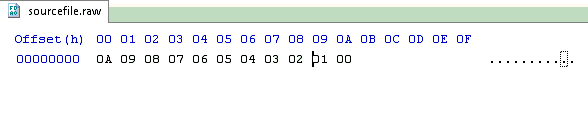
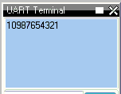

<div class="section">

<div class="titlepage">

<div>

<div>

### <span id="lookup_tables"></span>Lookup Tables

</div>

</div>

</div>

<span class="strong">**About Lookup Tables**</span>

A lookup table is a list of values that are stored in the memory of the
microcontroller, which then can be accessed using the `ReadTable`
command.

The advantage of lookup tables is that they are memory efficient,
compared to an equivalent set of alternative command statements.

Data tables are defined as follows:

<div class="orderedlist">

1.  a single value on each line
2.  byte, word, longs and integer values are valid.  
3.  Strings must be expressed as ASCII byte value(s)
4.  multiple elements on a single line separated by commas
5.  constants and calculations within the single line data table entries
    are permitted
6.  an external data source file
7.  decimal values are NOT supported  
      

</div>

<span class="strong">**Defining Tables**</span>

<span class="emphasis">*Single data values*</span>

A single value on each line with in the table.  The example table, shown
below, has the data on different line in within the table.

``` screen
    Table TestDataSource
        12
        24
        36
        48
        60
        72
    End Table

    Dim TableCounter, Invalue as byte

    CLS
    For TableCounter = 1 to 6
      ReadTable  TestDataSource, TableCounter, Invalue
      Print InValue
      Print ","
    Next
```

<span class="emphasis">*Multiple data values of the same line*</span>

Multiple elements on a single line separated by commas.  The example
table, shown below, has the data separated by `,` and on different line
in within the table.

``` screen
    Table TestDataSource
        12,  24, 36
        48,  60, 72
    End Table

    Dim TableCounter, Invalue as byte

    CLS
    For TableCounter = 1 to 6
      ReadTable  TestDataSource, TableCounter, Invalue
      Print InValue
      Print ","
    Next
```

<span class="emphasis">*Data values as constants, and, with data
transformation*</span>

Constants and calculations within the single line.   The example table,
shown below, uses a defined constant to multiple the data with the
table.

``` screen
#define calculation_constant 2

    Table TestDataSource
      1 * calculation_constant
      2 * calculation_constant
      3 * calculation_constant
      8 * calculation_constant
      4 * calculation_constant
      5 * calculation_constant
    End Table

    Dim TableCounter, Invalue as byte

    CLS
    For TableCounter = 1 to 6
      ReadTable  TestDataSource, TableCounter, Invalue
      Print InValue
      Print ","
    Next
```

     

<span class="emphasis">*Data values as Strings*</span>

Strings can be defined.  Strings are delimited by double quotes.    The
following examples show the methods.

Any ASCII characters between any two " " (double quotes) will be
converted to table data.   Also see ASCII escape codes.

A source string can be one string per line or comma separated strings,
therefore, on the same line.

Simple Example 1.

``` screen
    Table Test_1
     "ABCDEFGHIJ"
    End Table
```

Simple Example 2.

``` screen
    '
    Table  MnuTxt_1  'Home disp
       "  Display_1    Display_2    Display_3  "
    End Table

    Table MnuTxt_2   'Main Menu
     "1: Display"       ' Main1
     "2: System Setup"  ' Main2
     "3: Config 1"      ' Main3
     "4: Config 2"      ' Main4
     "5: Data Log"      ' Main5
     "6: Diagnostic"    ' Main6
     "7: Help+"         ' Main7
    End Table
```

The following 2 table lines produce the same table data.

``` screen
    "String1","String2", "String3"
    "String1String2String3"
```

And, the following 3 table lines produce the same table data.

``` screen
    "String1"
    "String2"
    "String3"
```

<span class="emphasis">*ASCII Escape code*</span>

Accepted escape strings are shown in the table below.

<div class="informaltable">

| Escape sequence | Meaning                                       |
|:----------------|:----------------------------------------------|
| \\a             | beep                                          |
| \\b             | backspace                                     |
| \\f             | formfeed                                      |
| \\l or \\n      | newline                                       |
| \\r             | carriage return                               |
| \\t             | tab                                           |
| \\0             | Nul value, equates to ASCII 0. Same as \\&000 |
| \\&nnn          | ascii char in decimal                         |
| \\\\            | backslash                                     |
| \\"             | double quote                                  |
| \\'             | single quote                                  |

</div>

<span class="strong">**Using Lookup Tables**</span>

First, the table must be created. The code to create a lookup table is
simple - a line that has `Table` and then the name of the table, a list
of numbers (up to 10,000 elements), and then `End Table`.

For tables with more than 255 elements it is mandated to used a WORD
variable to read the size of the table. See below for an example.

Once the table is created, the `ReadTable` command is used to read data
from it. The `ReadTable` command requires the name of the table it is to
read, the location of the item to retrieve, and a variable to store the
retrieved number in.

Lookup tables can store byte, word, longs and integer values.   Great
Cow BASIC will try automatically detect the type of the table depending
on the values in it.   Great Cow BASIC can be explicitly instructed to
cast the table to a variable type, as follows:

``` screen
    Table TestDataSource as [Byte | Word | Integer | Long ]
        12
        24
        36
        48
        60
        72
    End Table
```

<span class="emphasis">*Addresssing the Table Data*</span>

Item 0 of a lookup table stores the size of the table. If the
`ReadTable` command attempts to read beyond the end (number of data
items) of the table, the value 0 will be returned. For tables with more
than 255 elements it is <span class="strong">**mandatory**</span> to use
a WORD variable to read the size of the table. See example below.

``` screen
    dim lengthoftable as word

    readtable TestDataSource , 0, lengthoftable
    print lengthoftable  ; will print the size as a word

    table TestDataSource
    'a table with more than 255 elements
    ... 'item 1
    ...
    ...
    ...  'item 1027
    end table
```

<span class="emphasis">*Importing External Text File for table
conversion*</span>

An external file can be used as the table data source.   The file will
be read into the specified table name from the external file.   The
source file will be treated as a byte value file.

An example file is shown below:

<div class="informalfigure">

<div class="mediaobject" align="center">



</div>

</div>

The following program will import the external data file.

``` screen
    #chip 16f877a

    Table TestDataSource from "sourcefile.raw"

    for nn = 1 to 10
      ReadTable TestDataSource, nn, inc
      Print inc
    next
```

And the program will out the following:

<div class="informalfigure">

<div class="mediaobject" align="center">



</div>

</div>

  
  

<span class="emphasis">*Advanced use of Lookup Tables - using EEPROM for
Table data storage*</span>

You can use the `Table` statement to store the data table in EEPROM. If
the compiler is told to store a data table in "Data" memory, it will
store it in the EEPROM.

<span class="strong">**NOTE**</span> The limitation of of using EPPROM
tables is that you can only store BYTEs. You cannot store WORD values in
the EEPROM tables.

Example code:

``` screen
    #chip 16F628

    'Read table item
    'Must use ReadTable and a variable for the index, or the table won't be
    downloaded to EEPROM

    TableLoc = 2
    ReadTable TestDataSource, TableLoc, SomeVar

    'Write to table , this is not required
    EPWrite 1, 45

    'Table of values to write to EEPROM
    'EEPROM location 0 will store length of table
    'Subsequent locations will each store a value

    Table TestDataSource Store Data
        12
        24
        36
        48
        60
        72
    End Table
```

  
  

<span class="strong">**For more help, see**</span>
<a href="readtable" class="link" title="ReadTable">ReadTable</a>

</div>
