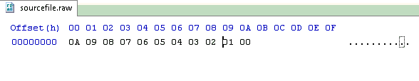
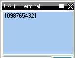

<<<<<<< Updated upstream
<div class="section">

<div class="titlepage">

<div>

<div>

### <span id="lookup_tables"></span>Lookup Tables

</div>

</div>

</div>

<span id="overview"></span><span class="strong">**Overview**</span>

<span class="emphasis">*A lookup table is a list of values stored in the
microcontroller’s memory and accessed using `ReadTable`.*</span>

<span class="emphasis">*Key Features*</span>

<div class="itemizedlist">

-   Efficient memory usage
-   Supports `byte`, `word`, `long`, and `integer` types
-   ASCII string definitions supported
-   Constants and inline calculations permitted
-   External data sources allowed

</div>

<span class="emphasis">*Note: Decimal values are not supported*</span>

<span class="strong">**Contents**</span>

<div class="itemizedlist">

-   <a href="lookup_tables#defining-tables" class="link">Defining Tables</a>
-   <a href="lookup_tables#strings" class="link">String Tables</a>
-   <a href="lookup_tables#escapes" class="link">ASCII Escape Sequences</a>
-   <a href="lookup_tables#reading" class="link">Reading Lookup Tables</a>
-   <a href="lookup_tables#external" class="link">Importing from External File</a>
-   <a href="lookup_tables#eeprom" class="link">EEPROM Table Storage</a>
-   <a href="lookup_tables#reference" class="link">Reference</a>

</div>

<span id="defining-tables"></span><span class="strong">**Defining
Tables**</span>

<span id="single-values"></span><span class="emphasis">*Single
Values*</span>

``` screen
Table TestDataSource
    12
    24
    36
    48
    60
    72
End Table
```

<span id="multiple-values"></span><span class="emphasis">*Multiple
Values*</span>

``` screen
Table TestDataSource
    12, 24, 36
    48, 60, 72
End Table
```

<span id="constants"></span><span class="emphasis">*Constants &
Calculations*</span>

``` screen
#define calculation_constant 2

Table TestDataSource
    1 * calculation_constant
    2 * calculation_constant
    3 * calculation_constant
    8 * calculation_constant
    4 * calculation_constant
    5 * calculation_constant
End Table
```

<span id="strings"></span><span class="strong">**String Tables**</span>

<span id="simple-strings"></span><span class="emphasis">*Simple
Examples*</span>

``` screen
Table Test_1
    "ABCDEFGHIJ"
End Table
```

``` screen
Table MnuTxt_1
    "  Display_1    Display_2    Display_3  "
End Table

Table MnuTxt_2
    "1: Display"
    "2: System Setup"
    "3: Config 1"
    "4: Config 2"
    "5: Data Log"
    "6: Diagnostic"
    "7: Help+"
End Table
```

<span id="string-formatting"></span><span class="emphasis">*Equivalent
Representations*</span>

<div class="itemizedlist">

-   `"String1", "String2", "String3"`
-   `"String1String2String3"`
-   `"String1"` `"String2"` `"String3"`

</div>

<span id="escapes"></span><span class="strong">**ASCII Escape
Sequences**</span>

<div class="informaltable">

| Escape     | Meaning                   |
|:-----------|:--------------------------|
| \\a        | Beep                      |
| \\b        | Backspace                 |
| \\f        | Formfeed                  |
| \\n or \\l | Newline                   |
| \\r        | Carriage Return           |
| \\t        | Tab                       |
| \\0        | Null value (ASCII 0)      |
| \\&nnn     | ASCII character (decimal) |
| \\\\       | Backslash                 |
| \\"        | Double quote              |
| \\'        | Single quote              |

</div>

<span id="reading"></span><span class="strong">**Reading Lookup
Tables**</span>

<span id="basic-reading"></span><span class="emphasis">*Basic
Reading*</span>

``` screen
Dim TableCounter, Invalue as byte

CLS
For TableCounter = 1 to 6
  ReadTable TestDataSource, TableCounter, Invalue
  Print InValue
  Print ","
Next
```

<span id="length-reading"></span><span class="emphasis">*Reading Table
Length*</span>

``` screen
Dim lengthoftable as word
ReadTable TestDataSource, 0, lengthoftable
Print lengthoftable
```

<span id="external"></span><span class="strong">**Importing from
External File**</span>

<div class="informalfigure">

<div class="mediaobject" align="center">



</div>

</div>

``` screen
#chip 16f877a
Table TestDataSource from "sourcefile.raw"

For nn = 1 to 10
  ReadTable TestDataSource, nn, inc
  Print inc
Next
```

<div class="informalfigure">

<div class="mediaobject" align="center">



</div>

</div>

<span id="eeprom"></span><span class="strong">**EEPROM Table
Storage**</span>

``` screen
#chip 16F628

TableLoc = 2
ReadTable TestDataSource, TableLoc, SomeVar

EPWrite 1, 45  'Optional write

Table TestDataSource Store Data
    12
    24
    36
    48
    60
    72
End Table
```

<span id="eeprom-limitations"></span><span class="emphasis">*EEPROM
Limitations*</span>

<div class="itemizedlist">

-   Only `BYTE` values are supported
-   `WORD`, `INTEGER`, or `LONG` are not compatible with EEPROM tables

</div>

<span id="reference"></span><span class="strong">**Reference**</span>

See: `ReadTable`

</div>
=======
>>>>>>> Stashed changes
