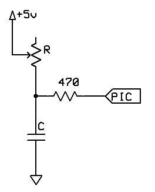

<div class="section">

<div class="titlepage">

<div>

<div>

#### <span id="pot"></span>Pot

</div>

</div>

</div>

<span class="strong">**Syntax:**</span>

``` screen
    Pot pin, output
```

<span class="strong">**Command Availability:**</span>

Available on all microcontrollers.

<span class="strong">**Explanation:**</span>

`Pot` makes it possible to measure an analog resistance with a digital
port, with the addition of a small capacitor. This is the required
circuit:

<span class="inlinemediaobject"></span>

The command works by using the microcontroller pin to discharge the
capacitor, then measuring the time taken for the capacitor to charge
again through the resistor.

The value for the capacitor must be adjusted depending on the size of
the variable resistor. The charging time needs to be approximately 2.5
ms when the resistor is at its maximum value. For a typical 50 k
potentiometer or LDR, a 50 nf capacitor is required.

This command should be used carefully. Each time it is inserted, 20
words of program memory are used on the chip, which as a rough guide is
more than 15 times the size of the Set command.

`pin` is the port connected to the circuit. The direction of the pin
will be dealt with by the `Pot` command.

`output` is the name of the variable that will receive the value.

<span class="strong">**Example 1:**</span>

``` screen
    'This program will beep whenever a shadow is detected
    'A potentiometer is used to adjust the threshold

    #chip 16F628A, 4

    #define ADJUST PORTB.0
    #define LDR PORTB.1
    #define SoundOut PORTB.2

    Dir SoundOut Out

    Do
        Pot ADJUST, Threshold
        Pot LDR, LightLevel
        If LightLevel > Threshold Then
            Tone 1000, 100
        End If
    Loop
```

<span class="strong">**Example 2:**</span>

This program is an implementation of the capacitor and resistor
principle using the chips internal capacitor and the internal pullup
resistor.

The will test the state of the GPIO.3 port by using these internal
components, and, after the charge state has been complete the LED PWM
will represent the detected value of signal on the GPIO.3 port.

It should be note that Great Cow BASIC will set the DIRection of GPIO.2
and GPIO.3 automatically. And, this solution is specific to the 12F509
and therefore the 12F509 register called `NOT_GPPU` may be different on
another chip.

``` screen
    #chip 12F509
    #option Explicit

      ;Defines (Constants)
      #define PWM_Out1 GPIO.2

      ;Variables
      Dim TimeCount As byte
      Dim OPTION_REG as byte

      Do Forever

          NOT_GPPU = Off
          Wait 1 ms
          NOT_GPPU = On
          TimeCount = 0

          'Do while held high by the internal capacitance
          Do While GPIO.3 = 1

            TimeCount = TimeCount + 1
            If TimeCount = 255 Then
                Exit Do
            End If

          Loop

          PWMout 1, TimeCount, 5

      Loop
```

<span class="strong">**See also**</span>
<a href="http://ladyada.net/library/rccalc" class="link">ladyada.net/library/rccalc</a>
or
<a href="http://web.archive.org/web/20100818230450/http://www.cvs1.uklinux.net/cgi-bin/calculators/time_const.cgi" class="link">cvs1.uklinux.net/cgi-bin/calculators/time_const.cgi</a>
for calculating capacitor value. These sites are not associated with
Great Cow BASIC.

</div>
