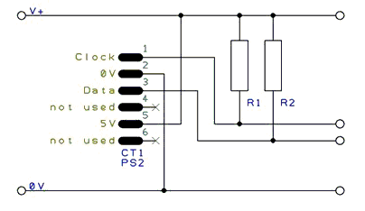

#### PS/2 Overview

**PS2 Overview**

These routines make it easier to communicate with a PS/2 device,
particularly an external keyboard.

**Relevant Constants**

These constants affect the operation of the PS/2 routines:

| **Constant Name** | **Controls**                                                                                     | **Default Value** |
|:----------------------------------------------|:-----------------------------------------------------------------------------------------------------------------------------|:----------------------------------------------|
| `PS2Data`                                     | Pin connected to PS/2 data line                                                                                              | Must be specified                             |
| `PS2Clock`                                    | Pin connected to PS/2 clock line.                                                                                            | Must be specified                             |
| `PS2_DELAY`                                   | This constant can be set to a delay, such as 10 ms. If set, a delay will be added at the end of every byte sent or received. | Not set                                       |

**Connections between the Keyboard and the
Microcontroller** The following diagram show a typical connection
between the keyboard and the microcontroller. The value of R1 and R2 is
typically 4.7k for a 5v system.

