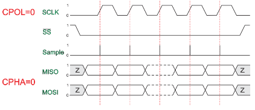
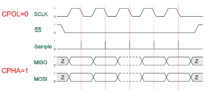
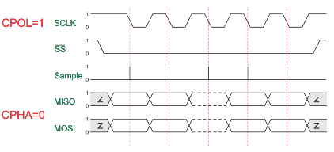
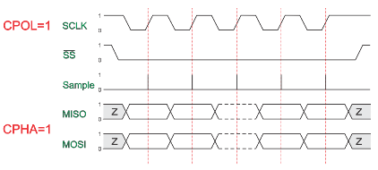

<div class="section">

<div class="titlepage">

<div>

<div>

#### <span id="spi_overview"></span>SPI Overview

</div>

</div>

</div>

<span class="strong">**Syntax:**</span>

The SPI interface allows for the transmission and receiption of data
simultaneously on two lines (MOSI and MISO).

The Clock polarity (CPOL) and clock phase (CPHA) are the main parameters
that define a clock format to be used by the SPI bus. Depending on CPOL
parameter, SPI clock may be inverted or non-inverted. CPHA parameter is
used to shift the sampling phase. If CPHA=0 the data are sampled on the
leading (first) clock edge. If CPHA=1 the data are sampled on the
trailing (second) clock edge, regardless of whether that clock edge is
rising or falling.

CPOL=0, CPHA=0

<div class="informalfigure">

<div class="mediaobject" align="center">



</div>

</div>

The data must be available before the first clock signal rising. The
clock idle state is zero. The data on MISO and MOSI lines must be stable
while the clock is high and can be changed when the clock is low. The
data is captured on the clock’s low-to-high transition and propagated on
high-to-low clock transition.

CPOL=0, CPHA=1

<div class="informalfigure">

<div class="mediaobject" align="center">



</div>

</div>

The first clock signal rising can be used to prepare the data. The clock
idle state is zero. The data on MISO and MOSI lines must be stable while
the clock is low and can be changed when the clock is high. The data is
captured on the clock’s high-to-low transition and propagated on
low-to-high clock transition.

CPOL=1, CPHA=0

<div class="informalfigure">

<div class="mediaobject" align="center">



</div>

</div>

The data must be available before the first clock signal falling. The
clock idle state is one. The data on MISO and MOSI lines must be stable
while the clock is low and can be changed when the clock is high. The
data is captured on the clock’s high-to-low transition and propagated on
low-to-high clock transition.

CPOL=1, CPHA=1

<div class="informalfigure">

<div class="mediaobject" align="center">



</div>

</div>

The first clock signal falling can be used to prepare the data. The
clock idle state is one. The data on MISO and MOSI lines must be stable
while the clock is high and can be changed when the clock is low. The
data is captured on the clock’s low-to-high transition and propagated on
high-to-low clock transition.

<span class="strong">**Key Commands**</span>

``` screen
    SPIMode  ( _Mode_ [, SPIClockMode])

    SPITransfer (  _OutByte_, _InByte_ )

    FastHWSPITransfer( _OutByte_ )

    #define HWSPIMode MASTERULTRAFAST       'MASTERSLOW | MASTER | MASTERFAST | MASTERULTRAFAST for specific AVRs only | MasterSSPADDMode for specific PICs SSPADD support
                                            'Defaults to MASTERFAST when microcontroller frequency less or equal to 32 mhz
                                            'Defaults to MASTER when microcontroller frequency more than 32 mhz.
```

The Great Cow BASIC used the microcontrollers hardware module for SPI.
The example below shows an implementation of Hardware and Software SPI.
Software SPI allows for a greater choice of ports to be used to control
the SPI operations.

<span class="strong">**Example**</span>

This example demonstrates the SPI capabilities for the mega328p. The
process is similar of any microcontroller..

This example show using the hardware SPI option and a sofware SPI
option.

Using hardware SPI mode - make sure the `#define SPI_HardwareSPI` is not
commented out. Using software SPI mode - comment out
`#define SPI_HardwareSPI`. The example code will then use software SPI.

<span class="strong">**Setting the SPI Mode**</span>

Hardware SPI mode the Data Out, Data In and Clock (DO/DI and SCK) cannot
be moved but the optional Data Command, Chip Select and Reset are all
moveable.

Software SPI mode the Data Out, Data In and Clock (DO/DI and SCK), Data
Command, Chip Select and Reset are all moveable.

Use the constant `HWSPIMode` to set the SPI frequency when using Great
Cow BASIC libraries.

``` screen
    #define HWSPIMode MASTERULTRAFAST
```

Great Cow BASIC libraries will default to to MASTERFAST when
microcontroller frequency less or equal to 32 mhz and default to MASTER
when microcontroller frequency more than 32 mhz.

The options for `HWSPIMode` are:

`MASTERSLOW`, or, `MASTER` or `MASTERFAST` or `MASTERULTRAFAST` for
specific AVRs only or `MasterSSPADDMode` for specific PICs SSPADD
support

This constant sets the library to the desire SPI fequency, therefore
enable adaption of the SPI frequency without have to change the library.

The SPI frequnecy must be the same for all the used devices.   In
particular, it must be set equal to the one dictated by the slowest SPI
device to be used.

More freedom is available when more than an hardware SPI is available as
well as when the user want to use hardware SPI for a device and software
SPI for a second one.

<span class="strong">**Using multiple SPI devices**</span>

There will be use cases were you need to use more than one SPI target
device at a time.  In such cases the device defined for SPI must be
inserted in your program for each device.

As an example using e-Paper and SRAM at the same time, with an hardware
SPI would require `#define SPISRAM_HARDWARESPI` and
`#define EPD_HardwareSPI`.  

Obviously, when all SPI devices use the same SPI lines, you must select
one device at a time by setting SPI Chip Select line to `OFF` for the
specific target SPI device, and you must set `ON` the SPI Chip Select
line for any other SPI device  -  this is a normal convention of SPI
usage.    This is not specific to Great Cow BASIC..

<span class="strong">**Code overview**</span>

``` literallayout
InitSPIMode calls SPIMode. if needed, when hardware mode, and set the port firections.
The sub SendByteviaSPI is called to handle whether to call the Hardware or use Software (bit-banging) SPI.
```

``` screen
        #chip mega328p, 16
        #option explicit
        #include <UNO_mega328p.h >

        #define SPI_HardwareSPI  'comment this out to make into Software SPI but, you may have to change clock lines

        'Pin mappings for SPI - this SPI driver supports Hardware SPI
        #define SPI_DC       DIGITAL_8          ' Data command line
        #define SPI_CS       DIGITAL_4          ' Chip select line
        #define SPI_RESET    DIGITAL_9          ' Reset line

        #define SPI_DI       DIGITAL_12          ' Data in | MISO
        #define SPI_DO       DIGITAL_11          ' Data out | MOSI
        #define SPI_SCK      DIGITAL_13          ' Clock Line

        dir SPI_DC    out
        dir SPI_CS    out
        dir SPI_RESET out
        dir SPI_DO    Out
        dir SPI_DI    In
        dir SPI_SCK   Out

        'If DIGITAL_10 is NOT used as the SPI_CS (sometimes called SS) the port must and output or set as input/pulled high with a 10k resistor.
        'As follows:
        'If CS is configured as an input, it must be held high to ensure Master SPI operation.
        'If the CS pin is driven low by peripheral circuitry when the SPI is configured as a Master with the SS pin defined as an input, the
        'SPI system interprets this as another master selecting the SPI as a slave and starting to send data to it!
        'If CS is an output SPI communications will commence with no flow control.
        dir DIGITAL_10 Out

        DIM byte1 As byte
        DIM byte2 As byte
        DIM byte3 As byte

        byte1 = 100 ' temp values (will come from potentiometer later)
        byte2 = 150
        byte3 = 200

        InitSPIMode


        do forever
            set SPI_CS OFF;
            set SPI_DC OFF;
            SendByteviaSPI (byte1)
            set SPI_CS ON;
            set SPI_DC ON

            set SPI_CS OFF;
            set SPI_DC OFF;
            SendByteviaSPI (byte2)
            set SPI_CS ON;
            set SPI_DC ON

            set SPI_CS OFF;
            set SPI_DC OFF;
            SendByteviaSPI (byte3)
            set SPI_CS ON;
            set SPI_DC ON

            wait 10 ms
        loop


    sub InitSPIMode

          #ifdef SPI_HardwareSPI
              SPIMode ( MasterFast, SPI_CPOL_0 + SPI_CPHA_0 )
          #endif

          set SPI_DO OFF;
          set SPI_CS ON;   therefore CPOL=0
          set SPI_DC ON;   deselect

    End sub

    sub  SendByteviaSPI( in SPISendByte as byte )

      set SPI_CS OFF
      set SPI_DC OFF;

      #ifdef SPI_HardwareSPI
         FastHWSPITransfer  SPISendByte
         set SPI_CS ON;
         exit sub
      #endif

      #ifndef SPI_HardwareSPI
      repeat 8

        if SPISendByte.7 = ON  then
          set SPI_DO ON;
        else
          set SPI_DO OFF;
        end if
        SET SPI_SCK On;           ; therefore CPOL=0 ==ON, and, where CPOL=1==ON
        rotate SPISendByte left
        set SPI_SCK Off;          ; therefore CPOL=0  =OFF, and, where CPOL=1==OFF

      end repeat
      set SPI_CS ON;
      set SPI_DO OFF;
      #endif

    end Sub
```

<span class="strong">**See also**</span>
<a href="spimode" class="link" title="SPIMode">SPIMode</a>,<a href="spitransfer" class="link" title="SPITransfer">SPITransfer</a>,<a href="fasthwspitransfer" class="link" title="FastHWSPITransfer">FastHWSPITransfer</a>

</div>
