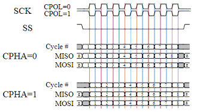

<div class="section">

<div class="titlepage">

<div>

<div>

#### <span id="spimode"></span>SPIMode

</div>

</div>

</div>

<span class="strong">**Syntax:**</span>

<span class="strong">**Legacy SPI Operations**</span>

``` screen
    SPIMode ( _Mode_ [, _SPIClockMode_])

    // Specfic the hardware SPI operating mode, can be MasterFast, Master, MasterSlow
    #DEFINE HWSPIMode   MasterFast

    // You can use a shared constant to set a consant with the desired SPIClockMode
    #DEFINE HWSPIClockMode  SPI_CPOL_0 + SPI_CPHA_0
```

<span class="strong">**AVRDX, 18FxxQxx, 18FxxK42 and 18xxFK83
microcontrollers**</span>

For HWSPI channel 0

``` screen
    SPIMode ( _Mode_ , _SPIClockMode_ )

    // Specfic the hardware SPI operating mode, can be MasterUltraFast, MasterFast, Master, MasterSlow
    #DEFINE HWSPIMode   MasterUltraFast

    // You can use a shared constant to set a consant with the desired SPIClockMode
    #DEFINE HWSPIClockMode  SPI_SS_0 + SPI_CPOL_0 + SPI_CPHA_0

    // Optionally change the SPI BAUD RATE from 4000
        #DEFINE SPI_BAUD_RATE 8000

    // Optionally update the SPI baud rate register with an explicit value
    //  typical use is to entry a specific calculated value
        #DEFINE SPI_BAUD_RATE_REGISTER  55
```

<span class="strong">**Command Availability:**</span>

Available on Microchip PIC and AVR microcontrollers with Hardware SPI
modules.

<span class="strong">**Explanation:**</span>

<span class="emphasis">*Mode*</span> sets the mode of the SPI module
within the microcontroller. These are the possible SPI Modes:

<div class="informaltable">

<span class="strong">**Mode Name**</span>

</div>

</div>

<span class="strong">**Description**</span>

<span class="strong">**Legacy SPI Operations**</span>

`MasterSlow`

Master mode, SPI clock is 1/64 of the frequency of the microcontroller.

`Master`

Master mode, SPI clock is 1/16 of the frequency of the microcontroller.

`MasterFast`

Master mode, SPI clock is 1/4 of the frequency of the microcontroller.

<span class="strong">**AVRDX, 18FxxQxx, 18FxxK42 and 18xxFK83
microcontrollers**</span>

`MasterSlow`

SPI clock baud rate is calculated INT( ChipMHz / INT( SPI\_BAUD\_RATE )
/ 16 \* 1000) + 1. Where SPI\_BAUD\_RATE defaults to 4000.

Also, see `SPI_BAUD_RATE` and `SPI_BAUD_RATE_REGISTER` for changing SPI
Baud Rate and settting the SPI Baud Rate register with an explicit value

`Master`

SPI clock baud rate is calculated as INT( ChipMHz / INT( SPI\_BAUD\_RATE
) / 4 \* 1000) + 1. Where SPI\_BAUD\_RATE defaults to 4000.

Also, see `SPI_BAUD_RATE` and `SPI_BAUD_RATE_REGISTER` for changing SPI
Baud Rate and settting the SPI Baud Rate register with an explicit value

`MasterFast`

SPI clock baud rate is calculated as INT( ChipMHz / INT( SPI\_BAUD\_RATE
) / 2 \* 1000) + 1. Where SPI\_BAUD\_RATE defaults to 4000.

Also, see `SPI_BAUD_RATE` and `SPI_BAUD_RATE_REGISTER` for changing SPI
Baud Rate and settting the SPI Baud Rate register with an explicit value

`MasterUltraFast`

SPI1BAUD is set to 0 and therefore the SPI clock baud rate to maximum

<span class="strong">**Slave Operations**</span>

`Slave`

Slave mode

`SlaveSS`

Slave mode, with the Slave Select pin enabled.

For <span class="strong">**Legacy microcontrollers SPI
operations**</span> <span class="emphasis">*SPIClockMode*</span> is an
optional parameter to set the mode of the SPI clock mode. This optional
parameter sets both the clock polarity and clock edge.

For <span class="strong">**Specific PICs microcontrollers SPI
operations**</span> <span class="emphasis">*SPIClockMode*</span> is a
mandated parameter to set the mode of the SPI clock mode and the clock
polarity bit. This parameter sets both the clock polarity and clock
edge.   There is no verification by the compiler if you do use the <span
class="emphasis">*\_SPIClockMode*</span> for the 18FxxQxx, 18FxxK42 and
18xxFK83 microcontrollers - the compiler uses the default value of
`SPI_SS = 0 & SPI_CPOL = 0 & SPI_CPHA = 0`  The use of SPI\_SS\_n
requires the PPS to be set.  If PPS is not set then the SPI\_SS will use
the default value specified in the specfic GCBASIC library.

For the \_SPIClockMode\_range, see the tables below:

<div class="informaltable">

<span class="strong">**SPIClockMode**</span>

</div>

<span class="strong">**Description**</span>

<span class="emphasis">*Legacy SPI operations*</span>

0

SPI\_CPOL = 0 & SPI\_CPHA = 0

1

SPI\_CPOL = 0 & SPI\_CPHA = 1

2

SPI\_CPOL = 1 & SPI\_CPHA = 0

3

SPI\_CPOL = 1 & SPI\_CPHA = 1

18FxxQxx, 18FxxK42 and 18xxFK83 microcontrollers

0

SPI\_SS = 0 & SPI\_CPOL = 0 & SPI\_CPHA = 0

2

SPI\_SS = 0 & SPI\_CPOL = 1 & SPI\_CPHA = 0

5

SPI\_SS = 1 & SPI\_CPOL = 0 & SPI\_CPHA = 1

7

SPI\_SS = 1 & SPI\_CPOL = 1 & SPI\_CPHA = 1

You can use a constant value or alternatively you can use constants to
set the SPIClockMode as follows:

``` screen
    _Legacy SPI microcontrollers_
    SPIMode ( MasterFast, SPI_CPOL_n + SPI_CPHA_n )

    _18FxxQxx, 18FxxK42 and 18xxFK83 microcontrollers_
    SPIMode ( MasterFast, SPI_SS_n + SPI_CPOL_n + SPI_CPHA_n )
```

Where the following parameters can be used as a calculation to set the
SPIClockMode.

<div class="informaltable">

<span class="strong">**Mode Name**</span>

</div>

<span class="strong">**Description**</span>

<span class="emphasis">*Legacy SPI operations and AVRs*</span>

SPI\_CPOL\_0

CPOL = 0

SPI\_CPOL\_1

CPOL = 1

SPI\_CPHA\_0

CPHA = 0

SPI\_CPHA\_1

CPHA = 1

18FxxQxx, 18FxxK42 and 18xxFK83 microcontrollers

SPI\_SS\_0

SS = 0 Clear polarity bit

SPI\_SS\_1

SS = 1 Set polarity bit

<span class="strong">**Explicitly changing the SPI baud rate on
18FxxQxx, 18FxxK42 and 18xxFK83 microcontrollers**</span>

You can explicitly change the SPI baud rate by defining the
`SPI_BAUD_RATE` constant as follows.   This will change the default SPI
baud from 4000 to the specified numeric value.

``` screen
    #DEFINE SPI_BAUD_RATE   8000
```

You can explicitly set the SPI baud rate register by defining the
`SPI_BAUD_RATE_REGISTER` constant as follows.   This will write the
explicit numeric value to the SPI baud register.   This overwrites any
compiler calculated value.

``` screen
    #DEFINE SPI_BAUD_RATE_REGISTER  55
```

<span class="strong">**Legacy SPI Summary:**</span>

When using SPI setting the clock frequency is completed using SPIMode,
and the master must also configure the clock polarity and phase with
respect to the data. Using the two options as CPOL and CPHA.

The timing diagram is shown below. The timing is further described and
applies to both the master and the slave device.

When CPOL=0 the base value of the clock is zero, i.e. the active state
is 1 and idle state is 0.

<div class="itemizedlist">

-   For CPHA=0, data are captured on the clock’s rising edge (low→high
    transition) and data is output on a falling edge (high→low clock
    transition).
-   For CPHA=1, data are captured on the clock’s falling edge and data
    is output on a rising edge.

</div>

When CPOL=1 the base value of the clock is one (inversion of CPOL=0),
i.e. the active state is 0 and idle state is 1.

<div class="itemizedlist">

-   For CPHA=0, data are captured on clock’s falling edge and data is
    output on a rising edge.
-   For CPHA=1, data are captured on clock’s rising edge and data is
    output on a falling edge.

</div>

When CPHA=0 means sampling on the first clock edge and , while CPHA=1
means sampling on the second clock edge, regardless of whether that
clock edge is rising or falling. Note that with CPHA=0, the data must be
stable for a half cycle before the first clock cycle.

In other words, CPHA=0 means transmitting data on the active to idle
state and CPHA=1 means that data is transmitted on the idle to active
state edge. Note that if transmission happens on a particular edge, then
capturing will happen on the opposite edge(i.e. if transmission happens
on falling, then reception happens on rising and vice versa). The MOSI
and MISO signals are usually stable (at their reception points) for the
half cycle until the next clock transition. SPI master and slave devices
may well sample data at different points in that half cycle.

This adds more flexibility to the communication channel between the
master and slave.

<div class="informalfigure">

<div class="mediaobject" align="center">



</div>

</div>

Legacy Example:

This example demonstrates the SPI capabilities for the mega328p. The
process is similar of any microcontroller..

You must set the data line as inputs and outputs.

``` screen
        #chip mega328p, 16
        #option explicit
        #include <UNO_mega328p.h >

        #define SPI_HardwareSPI  'comment this out to make into Software SPI but, you may have to change clock lines

        'Pin mappings for SPI - this SPI driver supports Hardware SPI
        #define SPI_DC       DIGITAL_8          ' Data command line
        #define SPI_CS       DIGITAL_4          ' Chip select line
        #define SPI_RESET    DIGITAL_9          ' Reset line

        #define SPI_DI       DIGITAL_12          ' Data in | MISO
        #define SPI_DO       DIGITAL_11          ' Data out | MOSI
        #define SPI_SCK      DIGITAL_13          ' Clock Line

        dir SPI_DC    out
        dir SPI_CS    out
        dir SPI_RESET out
        dir SPI_DO    Out
        dir SPI_DI    In
        dir SPI_SCK   Out

        'If DIGITAL_10 is NOT used as the SPI_CS (sometimes called SS) the port must and output or set as input/pulled high with a 10k resistor.
        'As follows:
        'If CS is configured as an input, it must be held high to ensure Master SPI operation.
        'If the CS pin is driven low by peripheral circuitry when the SPI is configured as a Master with the SS pin defined as an input, the
        'SPI system interprets this as another master selecting the SPI as a slave and starting to send data to it!
        'If CS is an output SPI communications will commence with no flow control.
        dir DIGITAL_10 Out


        dim outbyte, inbyte as byte


        #DEFINE HWSPICLOCKMODE  SPI_CPOL_0 + SPI_CPHA_0
        SPIMode ( MasterFast, HWSPICLOCKMODE )


       do
        set SPI_CS OFF//  Select line
        set SPI_DC OFF//  Send Data if off, or, Data if On
        SPITransfer ( outbyte, inbyte )
        set SPI_CS ON//   Deselect Line
        set SPI_DC ON
        wait 10 ms
       loop
```

<span class="strong">**18FxxQxx, 18FxxK42 and 18xxFK83 microcontrollers
SPI Summary:**</span>

When using SPI setting the clock frequency is completed using SPIMode,
and the master must also configure the clock polarity and phase with
respect to the data.    Using the three options as CPOL, CPHA and SS.

The timing diagram is as shown in the prevsious section that impacts
CPOL and CPHA.  

If you have set the PPS for SPI1SSPPS then control of the SPI SS ( also
know as CS / ChipSelect) is automatically controlled by the SPI
transmission.

<div class="itemizedlist">

-   Example:\*

</div>

``` screen
    #CHIP 18F16Q41,64

    #STARTUP InitPPS, 85
    #DEFINE PPSToolPart 18F16Q41

    // Use PPS to assign SPI capabilities to specific ports
    SUB InitPPS
        SPI1SDIPPS = 0x000C
        RB6PPS = 0x001B
        SPI1SCKPPS = 0x000E
        RB5PPS = 0x001C
        RC6PPS = 0x001D
        SPI1SSPPS = 0x0016
    END SUB


    // Optionally change the SPI BAUD RATE from 4000
        // #DEFINE SPI_BAUD_RATE 8000

    // Optionally update the SPI baud rate register with an explicit value
    //  typical use is to entry a specific calculated value
        // #DEFINE SPI_BAUD_RATE_REGISTER  1

    // Specfic the hardware SPI operating model
    // Can be MasterUltraFast, MasterFast, Master, MasterSlow
    #DEFINE HWSPIMode   MasterUltraFast

    // You can use a shared constant to set a consant with the desired SPIClockMode
    #DEFINE HWSPIClockMode  SPI_SS_0 + SPI_CPOL_0 + SPI_CPHA_0

    // Call SPIMode
    SPIMode (HWSPIMode,  HWSPIClockMode )

    // Define the GCBASIC required SPI port constants.
    // Must match any PPS defined.
    #DEFINE SPI_SCK   PORTB.6
    #DEFINE SPI_DO    PORTB.5
    #DEFINE SPI_DI    PORTB.4
    #DEFINE SPI_DC    PortC.1
    #DEFINE SPI_CS    PortC.6
    #DEFINE SPI_RESET PortC.2

    DO
        // Send 0x75 via SPI over and over again...
        FastHWSPITransfer 0x75
    LOOP
```

<span class="strong">**See also**</span>
<a href="spitransfer" class="link" title="SPITransfer">SPITransfer</a>,<a href="fasthwspitransfer" class="link" title="FastHWSPITransfer">FastHWSPITransfer</a>
