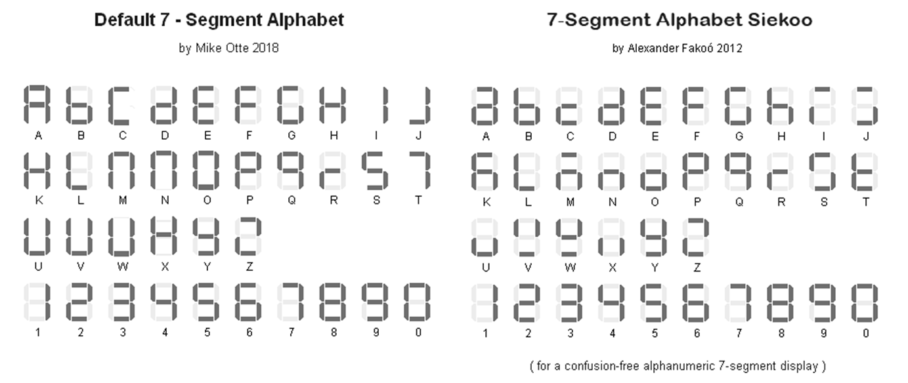

<div class="section">

<div class="titlepage">

<div>

<div>

###### <span id="tmwritechar"></span>TMWriteChar

</div>

</div>

</div>

<span class="strong">**Syntax:**</span>

``` screen
    TMWriteChar ( TMaddr, TMchar )
```

<span class="strong">**Command Availability:**</span>

Available on all microcontrollers.

<span class="strong">**Explanation:**</span>

<span class="emphasis">*TMaddr*</span> is 0 , 1 , 2 , 3 (display left to
right) <span class="emphasis">*TMchar*</span> is a letter from A to Z
(default alphabet) or from `a` to `z` Siekoo alphabet by Alexander
Fakoo, more info at:
[en.fakoo.de/siekoo](https://en.fakoo.de/siekoo).    You can
insert the special characters (blank, -, ) and/or ?).  
  
Character map:

<div class="informalfigure">

<div class="mediaobject" align="center">



</div>

</div>

  
  
  
  

<span class="strong">**See Also:**</span>

<div class="itemizedlist">

-   <a href="7_segment_displays_tm1637_4_digits" class="link" title="7 Segment Displays - TM1637 4 Digits">7 Segment Displays - TM1637 4 Digits</a> — category
    overview and a full worked example using TMWrite4Dig
-   <a href="7_segment_displays_overview" class="link" title="7 Segment Displays Overview">7 Segment Displays Overview</a> — top-level
    category overview

</div>

</div>
