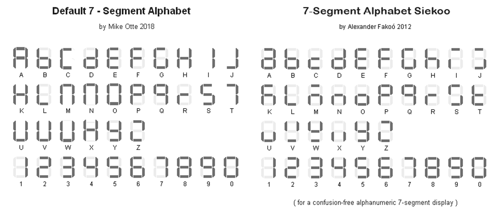

<div class="section">

<div class="titlepage">

<div>

<div>

###### <span id="tmwritechar_2"></span>TMWriteChar

</div>

</div>

</div>

<span class="strong">**Syntax:**</span>

``` screen
    TMWriteChar ( TMaddr, TMchar )
```

<span class="strong">**Command Availability:**</span>

Available on all microcontrollers.

<span class="strong">**Explanation:**</span>

<span class="emphasis">*TMaddr*</span> is 0 , 1 , 2 , 3 4, 5 (display
left to right) <span class="emphasis">*TMchar*</span> is a letter from A
to Z (default alphabet) or from `a` to `z` Siekoo alphabet by Alexander
Fakoo, more info at: <http://en.fakoo.de/siekoo>.    You can insert
the special characters (blank, -, ) and/or ?).  
  
Character map:

<div class="informalfigure">

<div class="mediaobject" align="center">



</div>

</div>

  
  
  
  

</div>
