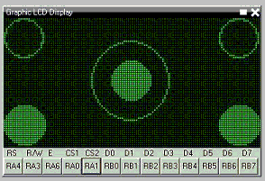

<div class="section">

<div class="titlepage">

<div>

<div>

### <span id="trigonometry_circle"></span>Trigonometry Circle

</div>

</div>

</div>

<span class="strong">**Explanation:**</span>

GCBASIC can draw circles on a Graphical LCD device using GCBASIC library
functions.

<div class="informalfigure">

<div class="mediaobject" align="center">



</div>

</div>

<span class="strong">**Demonstration program:**</span>

``` screen
    ;Circle and filled circle commands on a graphic LCD.
    ;This uses the 2-place trigonometric routines found in the include file.

    ;----- Configuration
    #CHIP 16F88, 8              ;PIC16F88 RUNNING AT 8 MHZ
    #CONFIG MCLR=OFF            ;RESET HANDLED INTERNALLY
    #OPTION EXPLICIT
    #DEFINE USELEGACYFORNEXT    ;WILL ENSURE THE OLD FOR-NEXT Loop is used just to save some memory as this is a very simple FOR-NEXT loop

    #INCLUDE <GLCD.H>
    #INCLUDE <TRIG2PLACES.H>

    ;----- Constants

    ;Pinout is shown for the LCM12864H-FSB-FBW
    ;graphical LCD available from Amazon.

    ;       +5V                 ;LCD pin 1
    ;       ground              ;LCD pin 2
    ;       Vo = wiper of pot   ;LCD pin 3
    #define GLCD_DB0 PORTB.0    ;LCD pin 4
    #define GLCD_DB1 PORTB.1    ;LCD pin 5
    #define GLCD_DB2 PORTB.2    ;LCD pin 6
    #define GLCD_DB3 PORTB.3    ;LCD pin 7
    #define GLCD_DB4 PORTB.4    ;LCD pin 8
    #define GLCD_DB5 PORTB.5    ;LCD pin 9
    #define GLCD_DB6 PORTB.6    ;LCD pin 10
    #define GLCD_DB7 PORTB.7    ;LCD pin 11
    #define GLCD_CS2 PORTA.0    ;LCD pin 12
    #define GLCD_CS1 PORTA.1    ;LCD pin 13
    #define GLCD_RESET PORTA.2  ;LCD pin 14
    #define GLCD_RW PORTA.3     ;LCD pin 15
    #define GLCD_RS PORTA.4     ;LCD pin 16
    #define GLCD_ENABLE PORTA.6 ;LCD pin 17
    ;       Vee = pot low side  ;LCD pin 18
    ;       backlight anode     ;LCD pin 19
    ;       backlight cathode   ;LCD pin 20

    #define GLCD_TYPE GLCD_TYPE_KS0108
    #define GLCD_WIDTH 128
    #define GLCD_HEIGHT 64


    ;----- Variables

    dim cx, cy, edge, jj as byte
    dim ii as word

    ;----- Program

    myCircle(10,10,10)
    ;upper left
    myCircle(117,10,10)                 ;upper right
    myCircleFilled(63,31,10)            ;center
    myCircle(63,31,20)                  ;center
    myCircleFilled(10,53,10)            ;lower left
    myCircleFilled(117,53,10)           ;lower right

    ;----- Subroutines

    sub myCircle(cenX, cenY, rad)
        ;Center of circle = (cenX,cenY), radius = rad

        for ii = 0 to 358 step 2                 ;every two degrees
            cx = cenX -((10*rad*cos(ii))/100+5)/10  ;properly rounded x value
            cy = cenY -((10*rad*sin(ii))/100+5)/10  ;properly rounded y value

            ;the following ignores the pixel if off the screen
            if (cx>=0 and cx<=GLCD_WIDTH and cy>=0 and cy<=GLCD_HEIGHT) then
            Pset(cx, cy, on)
            end if
        next ii
    end sub

    sub myCircleFilled(cenX, cenY, rad)
        ;Center of circle = (cenX,cenY), radius = rad

        for ii = 0 to 358 step 2
            cx = cenX -((10*rad*cos(ii))/100+5)/10
            cy = cenY -((10*rad*sin(ii))/100+5)/10
            edge = 2 * cenX - cx                  ;compute right edge

            for jj = cx to edge                    ;fill entire line, uses legacy for next permitting CX to be less than edge
                if (jj>=0 and jj<=GLCD_WIDTH and cy>=0 and cy<=GLCD_HEIGHT) then
                    Pset(jj,cy,on)
                end if
            next jj
        next ii
    end sub
```

<span class="strong">**See also**</span>
<a href="trigonometry_sine_cosine_and_tangent" class="link" title="Trigonometry Sine, Cosine and Tangent">Trigonometry</a>,
<a href="circle" class="link" title="Circle">Circle</a>,
<a href="filledcircle" class="link" title="FilledCircle">FilledCircle</a>,

</div>
