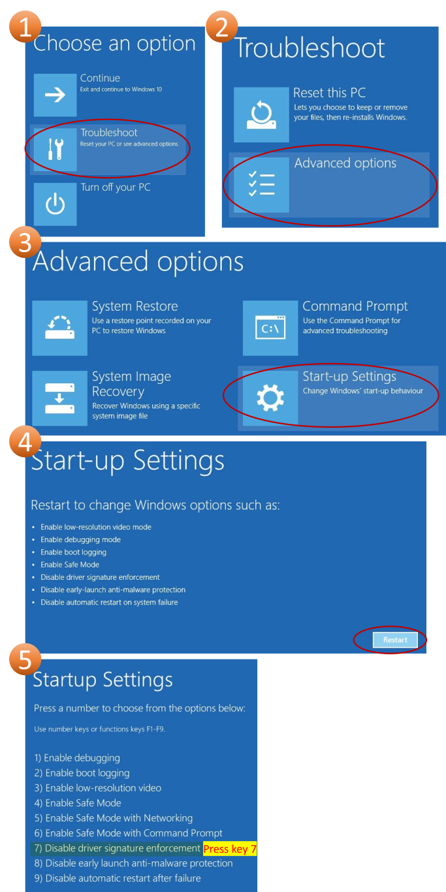

<div class="section">

<div class="titlepage">

<div>

<div>

### <span id="usb_drivers_installer"></span>USB Drivers Installer

</div>

</div>

</div>

<div class="warning" style="margin-left: 0.5in; margin-right: 0.5in;">

### Warning

Installing the USB driver is only required when using the GCBASIC USB
library.

</div>

<span class="strong">**Description:**</span>

The drivers for Windows x86 and x64 correspond to the USB LIBKWIN
capability of GCBASIC for supported PIC microcontrollers.

For security reasons, in Microsoft Windows, a driver must be digitally
signed by Microsoft in order to be installed.

Microsoft does provide a special "Test" mode for developers to manually
install unsigned drivers for debugging and testing, but this is a
technically advanced and not user-friendly procedure; at the same time,
Windows developers work to disable automated use of this capability, out
of concern that it could be used as an operating system vulnerability.

This makes installing test drivers difficult and frustrating for the
uninitiated, and for a useful hobby project it is not practical to put
end users through all this trouble.

This driver installer method resolves the constraints imposed by the
Windows operating system, allowing you to install the drivers in the
easiest way possible, much like any driver from a well-known company.

<span class="strong">**Usage:**</span>

<div class="warning" style="margin-left: 0.5in; margin-right: 0.5in;">

### Warning

The installer will reboot the system without notice. Please close all
programs and save any work you have open before beginning the driver
install.

</div>

1 - Open the installer; it will request admin rights.

2 - Navigate through the wizard to automatically extract the driver
files (there are no options to select).

3 - At the end of the wizard, after you click the exit button, the
system will restart automatically.

<div class="warning" style="margin-left: 0.5in; margin-right: 0.5in;">

### Warning

If your computer has Secure Boot enabled, the installer will advise you
of extra steps needed after reboot; at the end of this page you will
find a graphic showing those steps and which options you need to select.

</div>

4 - After restarting and logging in to your user account, a window will
inform you that the driver is not signed and ask if you want to install
it - please allow it.

5 - When the driver has been installed, the computer will restart
automatically.

  
  

<span class="strong">**Secure Boot Enabled, Boot menu steps**</span>  
  

<div class="informalfigure">

<div class="mediaobject" align="center">



</div>

</div>

  
  

<span class="strong">**USB Driver details**</span>

The driver uses the following USB flags.

``` programlisting
    USB_VID 0x1209
    USB_PID 0x2006
    USB_REV 0x0000
```

For other flag values, you need to modify and recompile the USB library.

`USB_PRODUCT_NAME` and `USB_VENDOR_NAME` can be changed without a
problem (Windows Device Manager will show the name reported by the
hardware, not the driver).

<span class="strong">**Tested on (but not limited to)**</span>

``` programlisting
    Windows 11 pro x64 secureboot disabled, os build Dev 21H2 22000.194
    Windows 11 pro x64 secureboot enabled, os build Dev rs_prerelease 22458.1000
    Windows 10 pro x64 secureboot disabled, os build stable 20H2 19042.867
    Windows 7 pro x86 secureboot disabled, os service pack 1 build 6.1.7601
```

<span class="strong">**See Also:**</span>

<div class="itemizedlist">

-   <a href="inputs_outputs" class="link" title="Inputs/Outputs">Inputs/Outputs</a> — category
    overview

</div>

</div>
